# Hash Blob metadata and content and store on chain when a Blob is created in Azure Blob Storage

## Overview

This logic app hashes blob metadata and contents and then stores it on chain when a blob is uploaded to Azure Blob Storage.

Specifically –

- It hashes the Blob contents and metadata
- Creates a new contract containing the hashed data and then adds it to the File Registry application

<a href="https://portal.azure.com/#create/Microsoft.Template/uri/https%3A%2F%2Fraw.githubusercontent.com%2FAzure-Samples%2Fblockchain-devkit%2Fmaster%2Faccelerators%2Fattestable-documents-and-media%2Fblockchain-workbench%2Fazure-blob-storage%2Fdeploy%2FLogicApp.json" target="_blank">    </a> <a href="http://armviz.io/#/?load=https%3A%2F%2Fraw.githubusercontent.com%2FAzure-Samples%2Fblockchain-devkit%2Fmaster%2Faccelerators%2Fattestable-documents-and-media%2Fblockchain-workbench%2Fazure-blob-storage%2Fdeploy%2FLogicApp.json" target="_blank"></a>

## Pre-Requisites

The pre-requisites for this sample include -

- An Azure Blob Storage deployment
- An Azure Blockchain Workbench deployment with a File Registry application deployed and the Registry opened

## Of Note

This sample is designed to work with the File Registry application and File contract.

## Create a Function App

Navigate to the Azure portal at <http://portal.azure.com>

Click the + symbol in the upper left corner of the screen to add a new resource.

Search for and select Function App and then click Create.

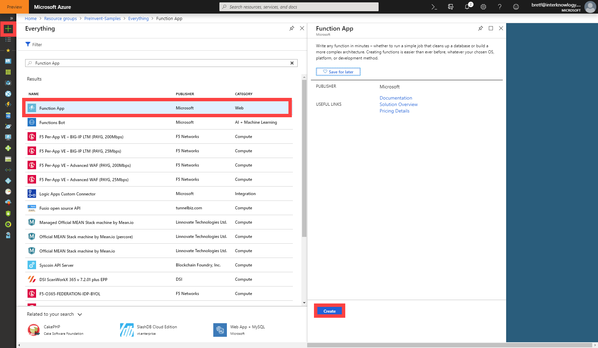

Choose a name for the Function App, make sure .NET is chosen for the Runtime Stack and then click Create.


Once your Function app is deployed, navigate to the resource.  In the Function App, click the + button next to the Functions entry to create a new Function.

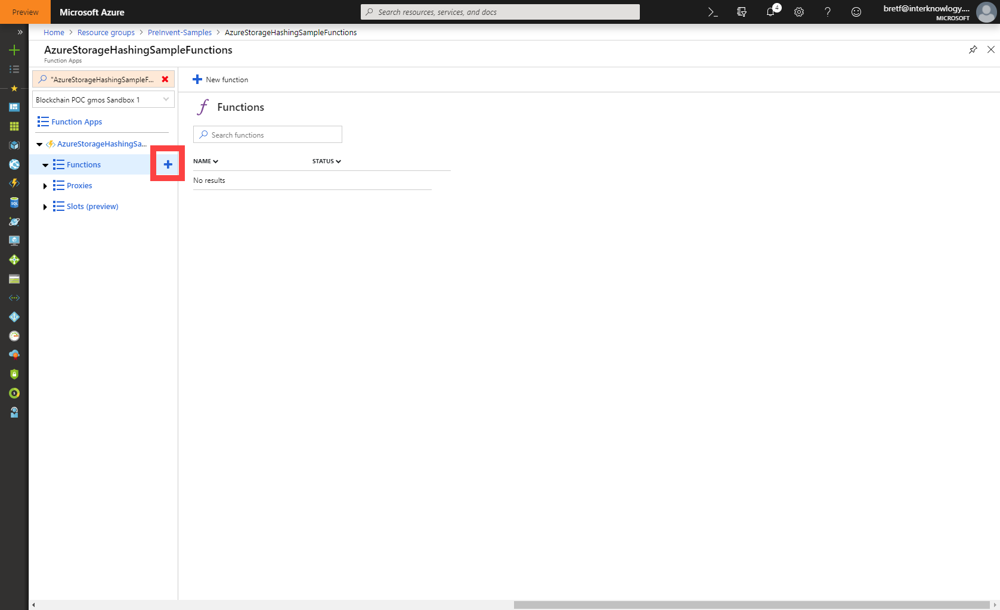

Select "In Portal" when asked to choose your development environment and then click Continue.

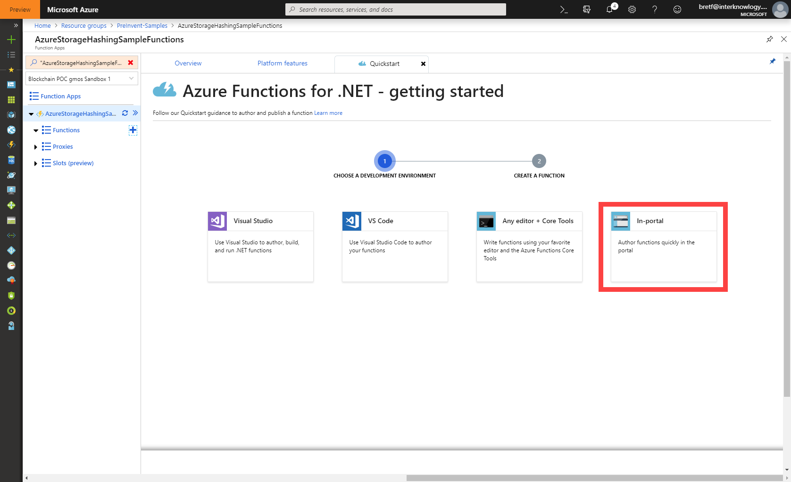

Select "More Templates" and click Finish and view templates.


Select "HTTP Trigger" or search for it if necessary.

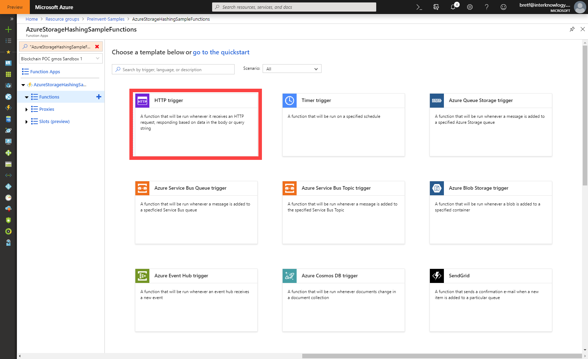

Name your function "GenericHashFunction" and then click Create.

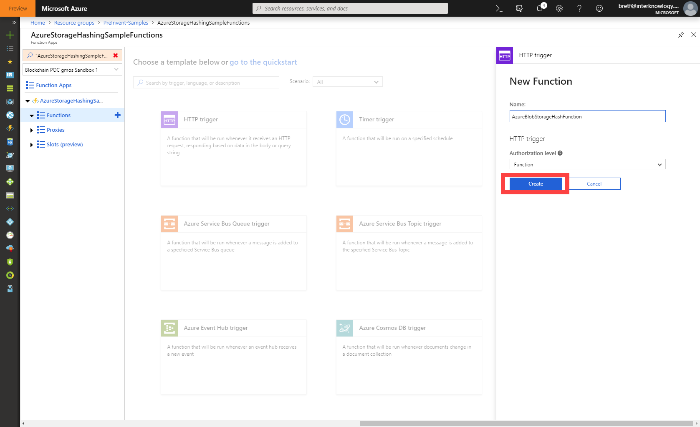

In the Function editor, replace the default code with the code below and then click Save.

```c#
#r "Newtonsoft.Json"

using System.Net;
using Microsoft.AspNetCore.Mvc;
using Microsoft.Extensions.Primitives;
using Newtonsoft.Json;
using System.Security.Cryptography;
using System.Text;

public static async Task<IActionResult> Run(HttpRequest req, ILogger log)
{
    log.LogInformation("C# HTTP trigger function processed a request.");

    string requestBody = await new StreamReader(req.Body).ReadToEndAsync();

    if (string.IsNullOrWhiteSpace(requestBody))
        return new BadRequestObjectResult("File content or metadata failed to be hashed.");

    string contentHash = ComputeSha256Hash(requestBody);
        
    return (ActionResult)new OkObjectResult(contentHash);
}

public static string ComputeSha256Hash(string rawData)  
{  
    // Create a SHA256   
    using (SHA256 sha256Hash = SHA256.Create())  
    {  
        // ComputeHash - returns byte array  
        byte[] bytes = sha256Hash.ComputeHash(Encoding.UTF8.GetBytes(rawData));  

        // Convert byte array to a string   
        StringBuilder builder = new StringBuilder();  
        for (int i = 0; i < bytes.Length; i++)  
        {  
            builder.Append(bytes[i].ToString("x2"));  
        }  
        return builder.ToString();  
    }  
} 
```


## Create the Logic App

Click the + symbol in the upper left corner of the screen to add a new resource.

Search for and select Logic App and then click Create.


Name the logic app “AzureHashBlobAndCreateContractOnUpload”.

Specify the same resource group as your Azure Blockchain Workbench deployment.

Click the Create button.


A logic app is initiated by a trigger.

In this scenario, the trigger will be when a blob is created in your Azure Blob Storage.

Within the Logic App Designer, select "Blank Logic App".

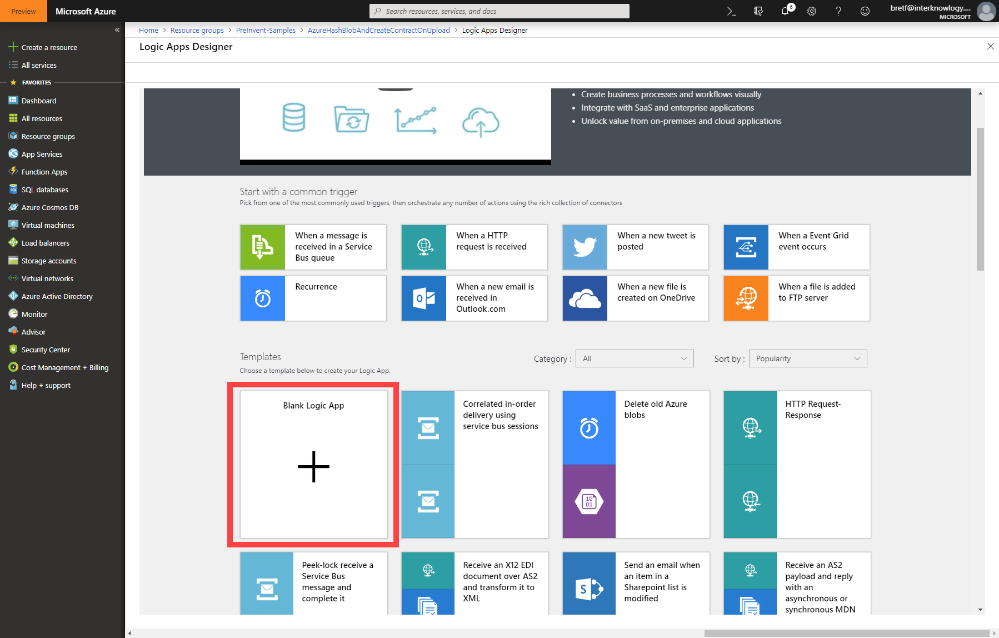

Search for Azure Blob Storage and then click "When a blob is added or modified".

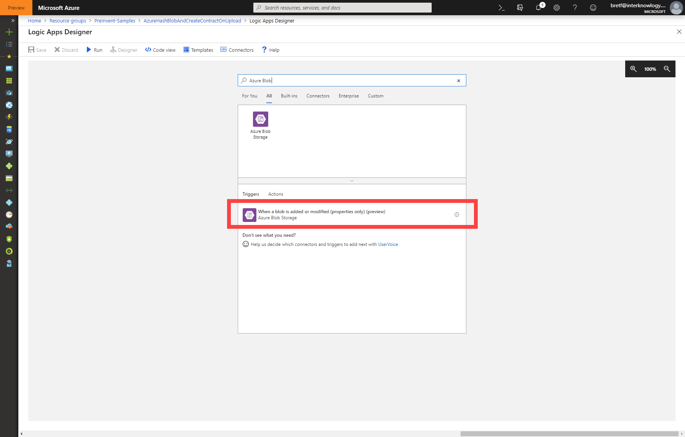

Enter a name for the connection, select your Azure Blob Storage Account and then click Create.

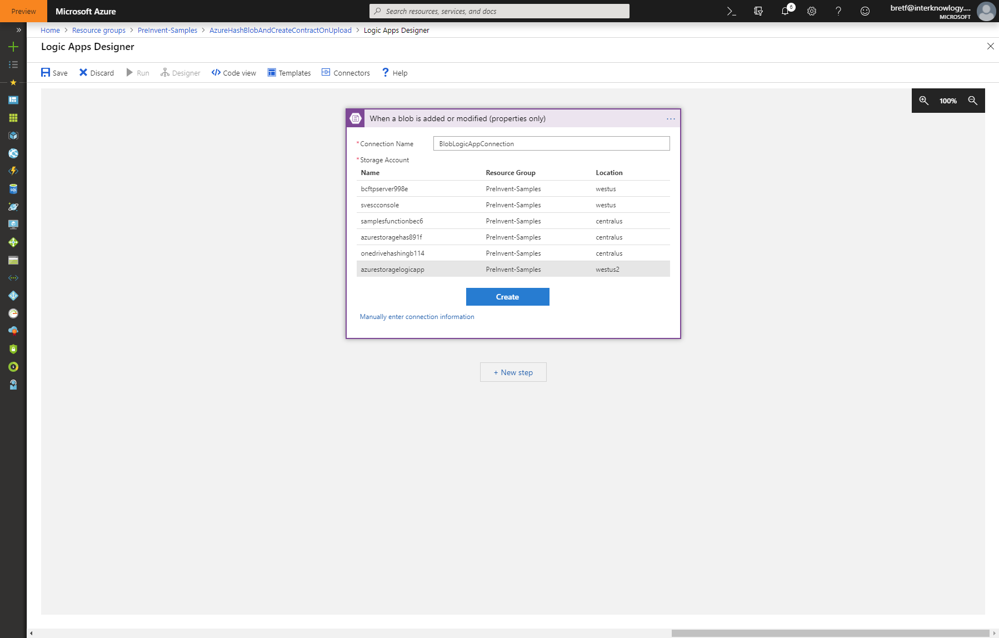

After the connection is created, choose a container to watch, set your polling interval and then click "+ New Step".

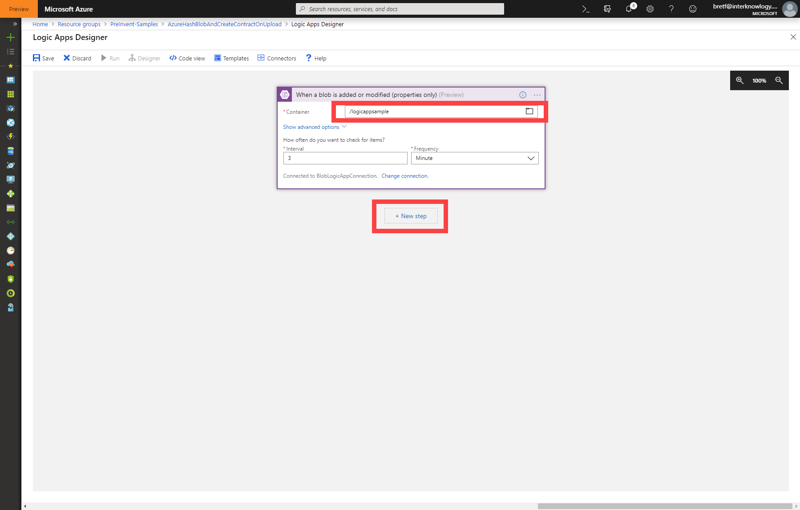

Search for Azure Blob Storage and then select "Get blob content".


Click in the Blob field and select "List of files Id" from the dynamic content menu.

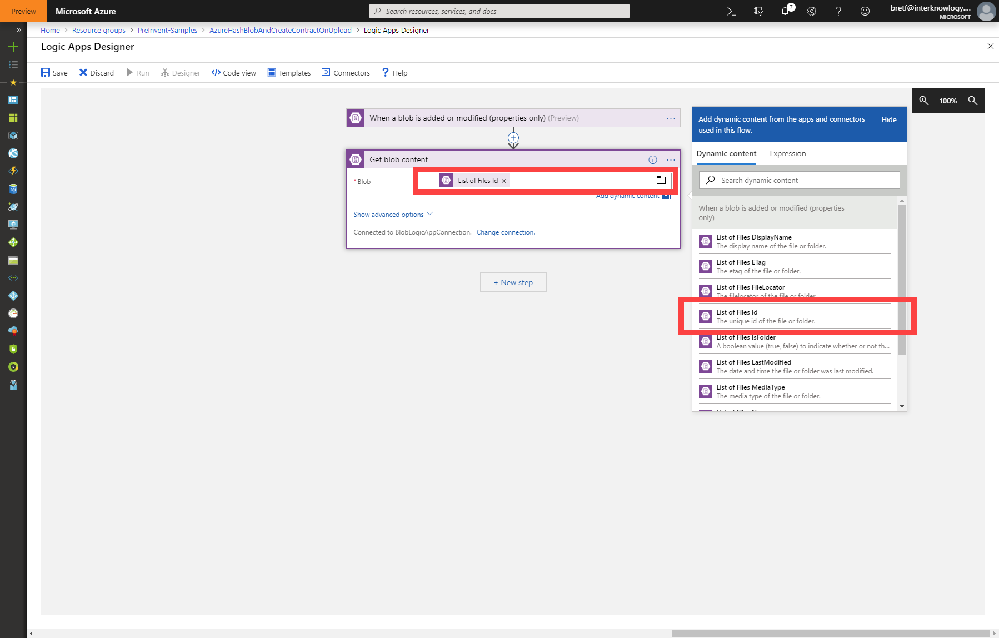

Click "+ New Step" then search for Azure Function and select "Choose an Azure function".  Select the Function created above.

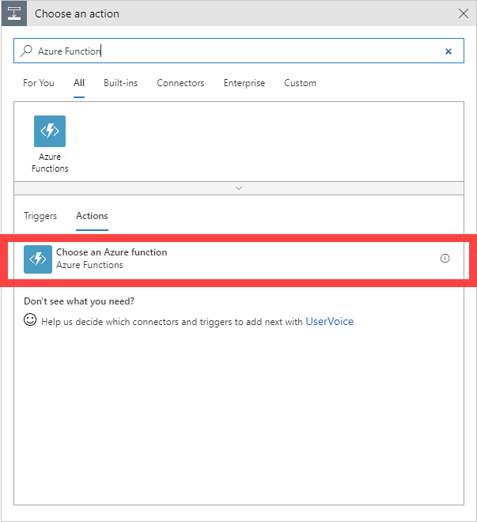

We will call this function twice, once for the content and again for the metadata.  Blob content is returned as an object containing the properties "\$content-type" and "\$content" so we'll need to pull out just the content value. For the first call, click the Request Body field and enter "@body('Get_blob_content').\$content".  Click the three dots at the top, select "Rename" and name this function "Hash File Content".


Repeat the steps above to add a second call to the Azure Function.  This time we will hash the metadata about the blob.  The Request Body can be either a singular value or any custom JSON object.  For this second call, we will be using a custom JSON object.  Design the Request Body using the dynamic content popup so that it looks like the  following image. Click the three dots at the top, select "Rename" and name this function "Hash File Metadata".

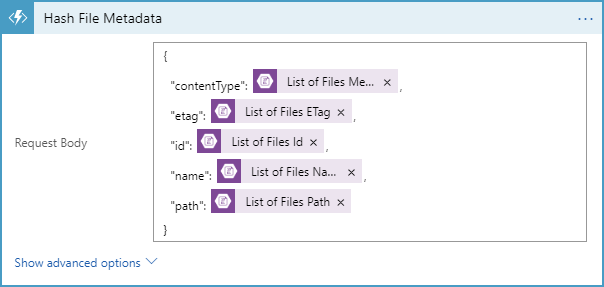

Click "+ New Step" and then search for "Variables" and select the "Initialize Variable" action.

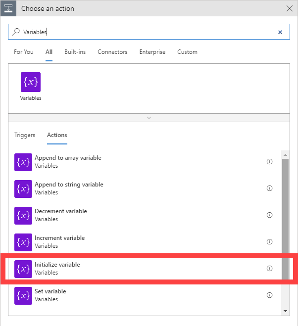

Name the variable "RequestId" and select String for the Type.  Click in the Value field and select "Expression" in the dynamic content popup.  Then type "guid()" in the function box and click OK.

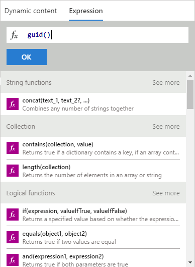

Repeat the process and this time enter "ProcessDateTime" as the name. The expression for this variable is "utcNow()".


Click "+ New Step" and then search for and select Service Bus.  Then choose the "Send Message" action.

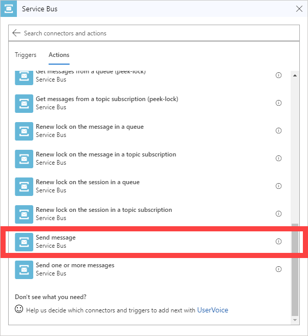

In the Send Message action, search for and select the "activityhub" queue that is in you Azure Blockchain Workbench resource group. Set the SessionId field to be the "RequestId" variable created above. Select the Content field and build the following structure using the dynamic content fields from the steps above.  If the outputs of a step aren't shown, click the "See more" link under that section.

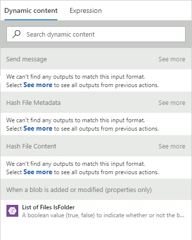

Paste this message structure in the Content field and then fill in the blank fields using the values output from the steps above, the address of the File Registry application, and your user chain Id from the Azure Blockchain Workbench.  Make sure to put the dynamic values between the quotes.  Remember, the content hash is the result for the first Azure Function call (the Body object) and the metadata hash is the result of the second Azure Function call.

```json
{
    "requestId": "",
    "userChainIdentifier": "<User chain address with BlockchainAgent role>",
    "applicationName": "FileRegistry",
    "workflowName": "File",
    "parameters": [
        {
            "name": "registryAddress",
            "value": "<File Registry contract address from Azure Blockchain Workbench>"
        },
        {
            "name": "fileId",
            "value": ""
        },
        {
            "name": "location",
            "value": ""
        },
        {
            "name": "fileHash",
            "value": ""
        },
        {
            "name": "fileMetadataHash",
            "value": ""
        },
        {
            "name": "contentType",
            "value": ""
        },
        {
            "name": "etag",
            "value": 
        },
        {
            "name": "processedDateTime",
            "value": ""
        }           
    ],
    "connectionId": 1,
    "messageSchemaVersion": "1.0.0",
    "messageName": "CreateContractRequest"
}
```

It should look similar to this when completed

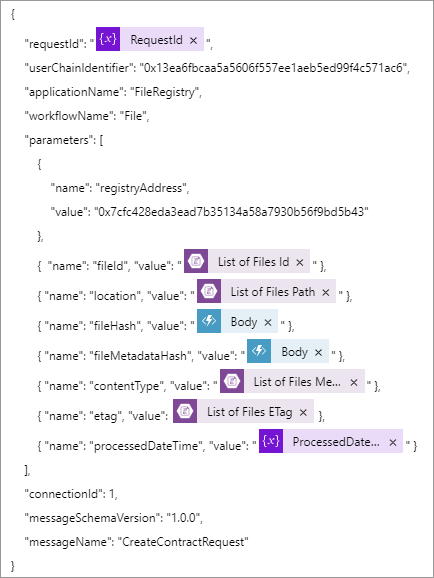

Save your Logic App

## Testing

You can test this functionality by taking the following steps –

1. Navigate to the overview page of for the logic app in the portal and confirm
   that it is enabled (if it is not, click on the “disabled” link at the top of
   the screen to transition the logic app to an enabled state).
2. Deploy the File Registry and File sample applications in Azure Blockchain
   Workbench.
3. Add members to the new application for the roles of Registrar, Registrant,
   and BlockchainAgent.
4. Create a new contract instance in the File Registry application. Once deployed, select the new Registry and perform the Open Registry action.
5. Upload an image file to your Blob Storage used in the logic app.
6. The logic app should now be triggered and the code will be executed.
   Upon successful execution, you should see a File entry in your File workbench application.
   If you’d like to look at the execution of the logic app,
   navigate to the logic app in the portal. At the bottom of the screen, you
   will detail for Runs history

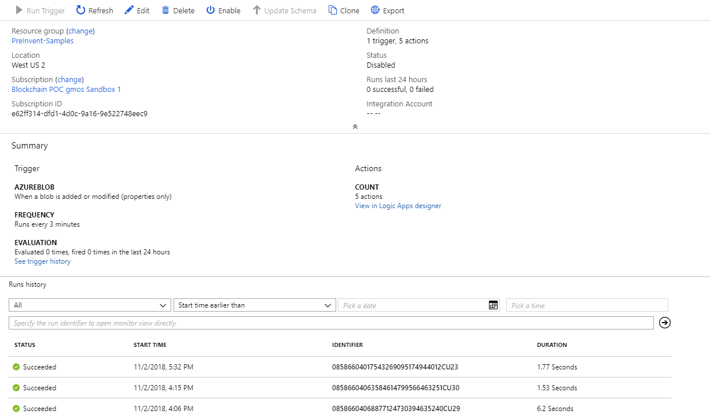

7. Click on the most recent execution of your logic app in the list.  
   This will show details on the trigger and actions executing within the logic
   app and allow you to validate success or troubleshoot reasons for failure.

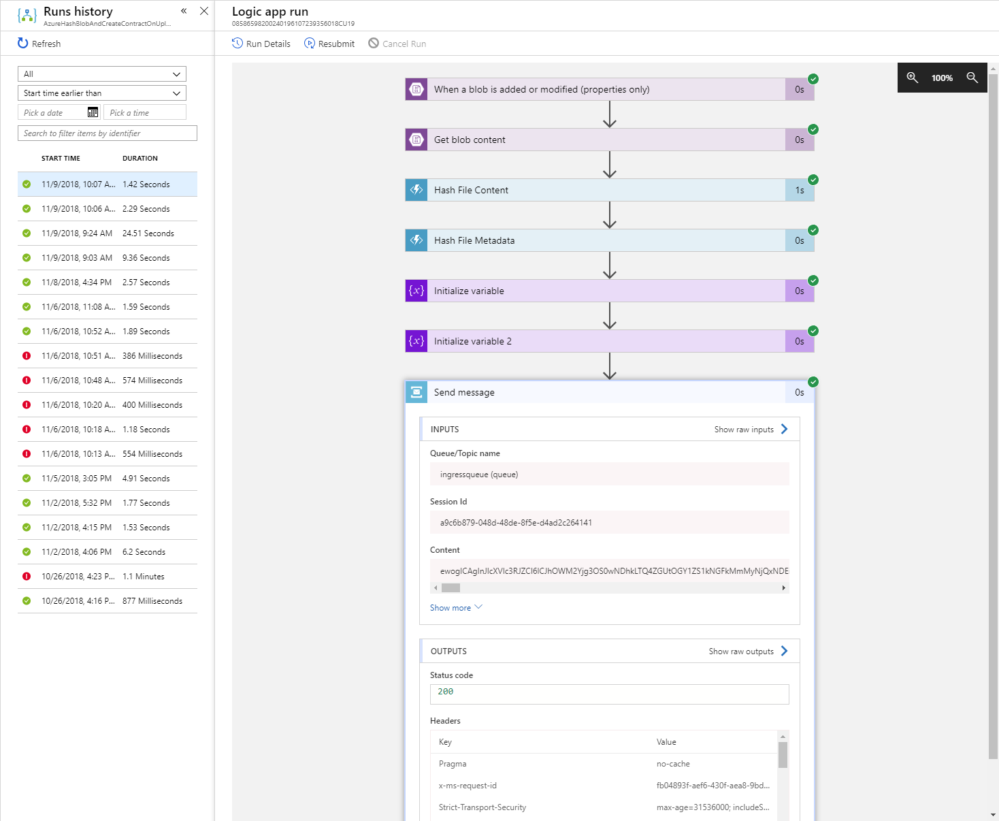

8. Once making changes in your logic app, you can navigate back to this same
   screen and click “Resubmit” and it will call the current version of your
   logic app with the values provided by the previous run.

### In Review

This sample deployed and configured a logic app that will hash file content and metadata and deploy a smart contract in an Azure Blockchain Workbench application.

This sample is designed to work with the File Registry sample application and contracts but can be easily adapted to other contracts by making changes to Service Bus – Send a Message action at the end of the sample to reflect the specifics of the new contract.
