Blockchain Alexa Bot
====================

This sample demonstrates the building of an Alexa Skill and a corresponding
logic app that facilitates user interaction with a blockchain via Amazon’s
Alexa.

Installation and Configuration
------------------------------

You will begin by installing working using the Azure Marketplace.

Once installed, deploy the Simple Marketplace contract to Workbench. The
contract and workbench configuration [can be found in
GitHub.](https://github.com/Azure-Samples/blockchain/tree/master/blockchain-workbench/application-and-smart-contract-samples/simple-marketplace)

Assign users to the contract and be aware of the contract identifiers for the
users you would like to have interact with Alexa.

If you’re unsure of the chain identifiers for the users, you can query the
workbench database.

Navigate to the [Alexa Developer
Console](https://developer.amazon.com/alexa/console/ask?) and log in with your
Amazon credentials.

Click the Create Skill button.

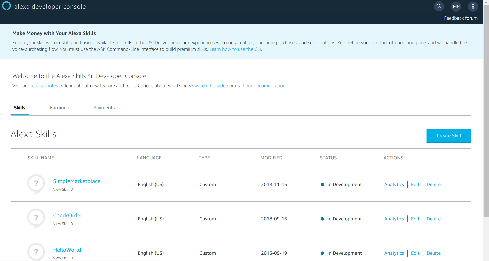

You will be prompted for the name of your skill. Provide the name
“SimpleMarketplace” and click the “Create skill” button.

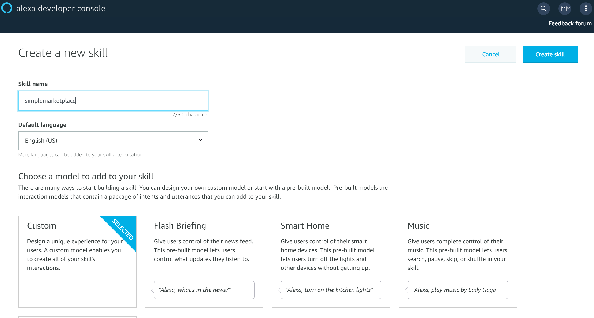

On the “Choose a template” screen, select “Start from scratch” and click
continue.

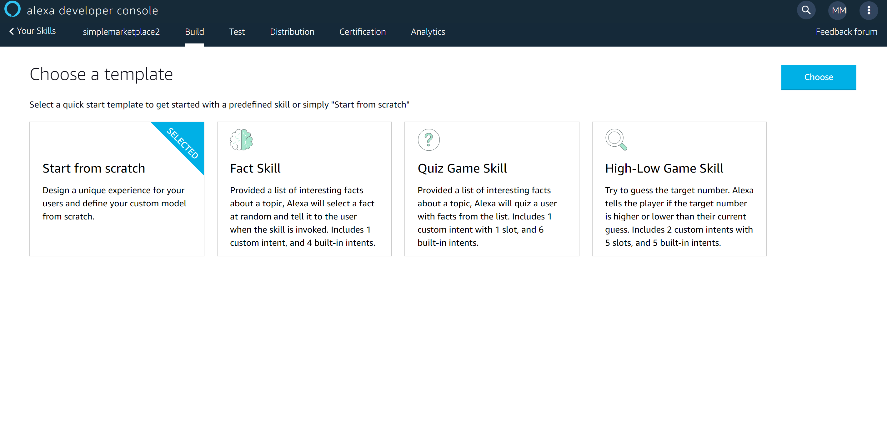

Click on the Invocation Name from the checklist shown on the right side of the
screen.

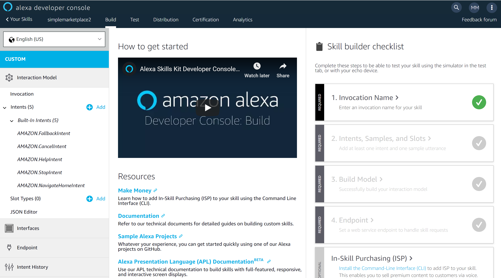

Next, type “simplemarketplace” as the Skill Invocation Name.

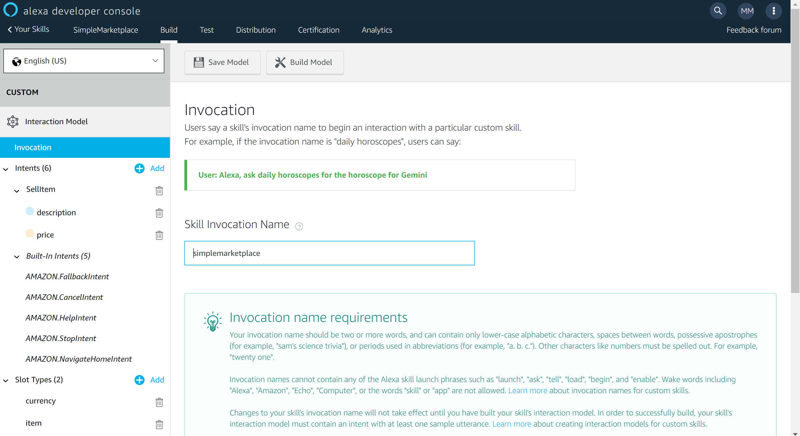

In this example, you’ll be interacting with the Simple Marketplace contract. The
Simple Marketplace has two parameters in its constructor – a description of an
item you’d like to sell and a price for that item.

Amazon does not have a string type nor does it have a currency type. To
accommodate those types of data you need to create custom slot types that you
will use later. In the menu on the left, click the + sign button next to Slot
Types.

Create a new slot type named currency and then add numeric values to the
appropriate decimal positions to the left and right of the decimal place. Click
Save Model when you’re done.

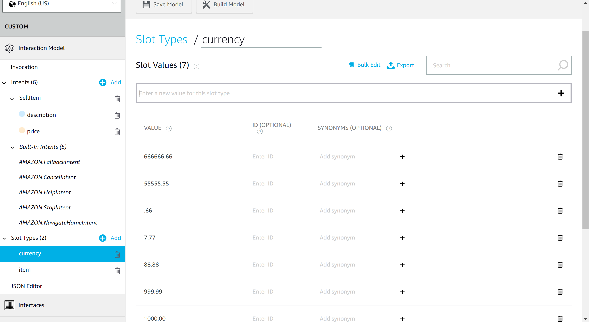

You will also need to create another custom slot to accommodate the item name.
In this case, you can provide text that showcases the types of things you’d like
to sell.

For the sample we created, words like securities, bonds, stock, car, and other
words were used.

With the slots defined

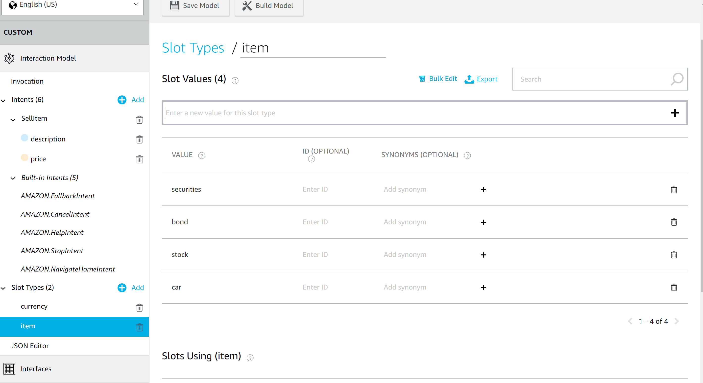

With the custom slots defined, the next step is to add Intents. Click the Add
button located next to Intents in the side menu.

This will display the Add Intent page.

Name the intent “OfferItemForSale” and click the “Create custom intent” button.

You will then be prompted for sample utterances for this intent.

The following are examples used for the simple marketplace sample contract.

Sell my {description} for {price} dollars

Make a new contract for {description} at {price} dollars

Put {description} on marketplace for {price} dollars

Sell {price} worth of {description}

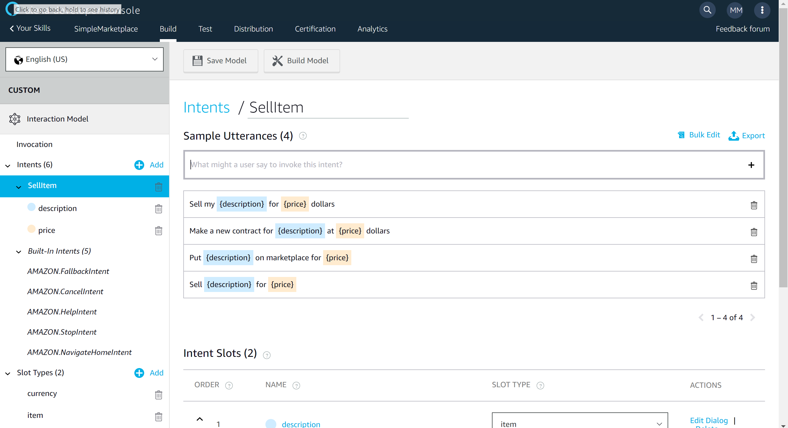

Each of the named slots should be mapped to the corresponding custom slots
(price, description) that you defined previously.

Note - If there are better utterances for your scenario, these can be modified
at your discretion.

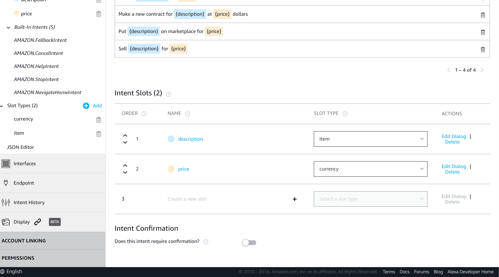

You will now want to click the Build Model button and confirm that the model
builds without errors.

Once the model compiles correctly, the next step is to create the logic app.

In the Azure Portal (<http://portal.azure.com>), add a new resource and select
“Logic App”.

Give the Logic App a new and identify the resource group, then press the
“Create” button.

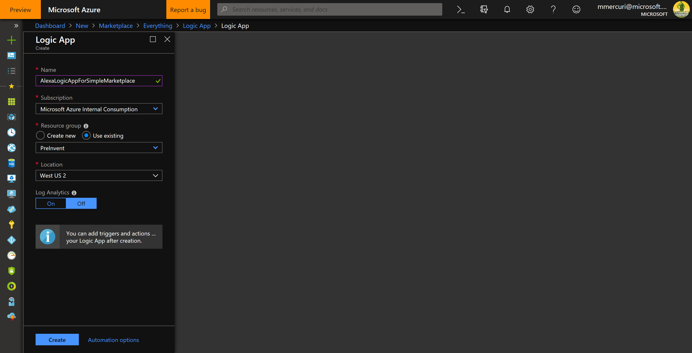

Click the “Blank Logic App” as the template for the Logic App.

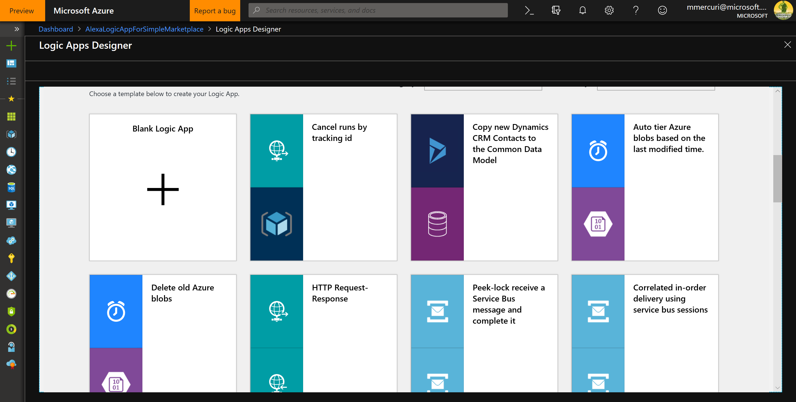

When the Logic App design surface is displayed, select the HTTP Request.

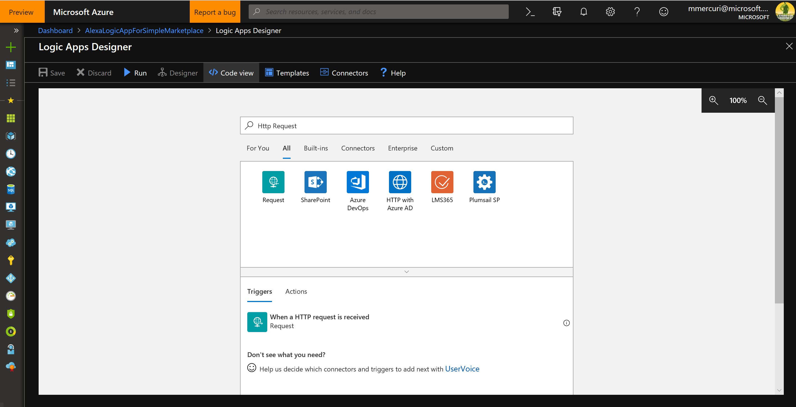

Past the following text into the trigger to specify the schema for the messages
originating from the Alexa service.

{

"properties": {

"context": {

"properties": {

"System": {

"properties": {

"apiAccessToken": {

"type": "string"

},

"apiEndpoint": {

"type": "string"

},

"application": {

"properties": {

"applicationId": {

"type": "string"

}

},

"type": "object"

},

"device": {

"properties": {

"deviceId": {

"type": "string"

},

"supportedInterfaces": {

"properties": {},

"type": "object"

}

},

"type": "object"

},

"user": {

"properties": {

"userId": {

"type": "string"

}

},

"type": "object"

}

},

"type": "object"

},

"Viewport": {

"properties": {

"currentPixelHeight": {

"type": "integer"

},

"currentPixelWidth": {

"type": "integer"

},

"dpi": {

"type": "integer"

},

"experiences": {

"items": {

"properties": {

"arcMinuteHeight": {

"type": "integer"

},

"arcMinuteWidth": {

"type": "integer"

},

"canResize": {

"type": "boolean"

},

"canRotate": {

"type": "boolean"

}

},

"required": [

"arcMinuteWidth",

"arcMinuteHeight",

"canRotate",

"canResize"

],

"type": "object"

},

"type": "array"

},

"pixelHeight": {

"type": "integer"

},

"pixelWidth": {

"type": "integer"

},

"shape": {

"type": "string"

},

"touch": {

"items": {

"type": "string"

},

"type": "array"

}

},

"type": "object"

}

},

"type": "object"

},

"request": {

"properties": {

"intent": {

"properties": {

"confirmationStatus": {

"type": "string"

},

"name": {

"type": "string"

},

"slots": {

"properties": {

"description": {

"properties": {

"confirmationStatus": {

"type": "string"

},

"name": {

"type": "string"

},

"resolutions": {

"properties": {

"resolutionsPerAuthority": {

"items": {

"properties": {

"authority": {

"type": "string"

},

"status": {

"properties": {

"code": {

"type": "string"

}

},

"type": "object"

},

"values": {

"items": {

"properties": {

"value": {

"properties": {

"id": {

"type": "string"

},

"name": {

"type": "string"

}

},

"type": "object"

}

},

"required": [

"value"

],

"type": "object"

},

"type": "array"

}

},

"required": [

"authority",

"status",

"values"

],

"type": "object"

},

"type": "array"

}

},

"type": "object"

},

"source": {

"type": "string"

},

"value": {

"type": "string"

}

},

"type": "object"

},

"price": {

"properties": {

"confirmationStatus": {

"type": "string"

},

"name": {

"type": "string"

},

"resolutions": {

"properties": {

"resolutionsPerAuthority": {

"items": {

"properties": {

"authority": {

"type": "string"

},

"status": {

"properties": {

"code": {

"type": "string"

}

},

"type": "object"

}

},

"required": [

"authority",

"status"

],

"type": "object"

},

"type": "array"

}

},

"type": "object"

},

"source": {

"type": "string"

},

"value": {

"type": "string"

}

},

"type": "object"

}

},

"type": "object"

}

},

"type": "object"

},

"locale": {

"type": "string"

},

"requestId": {

"type": "string"

},

"timestamp": {

"type": "string"

},

"type": {

"type": "string"

}

},

"type": "object"

},

"session": {

"properties": {

"application": {

"properties": {

"applicationId": {

"type": "string"

}

},

"type": "object"

},

"new": {

"type": "boolean"

},

"sessionId": {

"type": "string"

},

"user": {

"properties": {

"userId": {

"type": "string"

}

},

"type": "object"

}

},

"type": "object"

},

"version": {

"type": "string"

}

},

"type": "object"

}

Clicking Save will generate a URL for your Logic App.

Go back to the Alexa Console, select your skill and then click on Endpoint in
the left navigation bar.

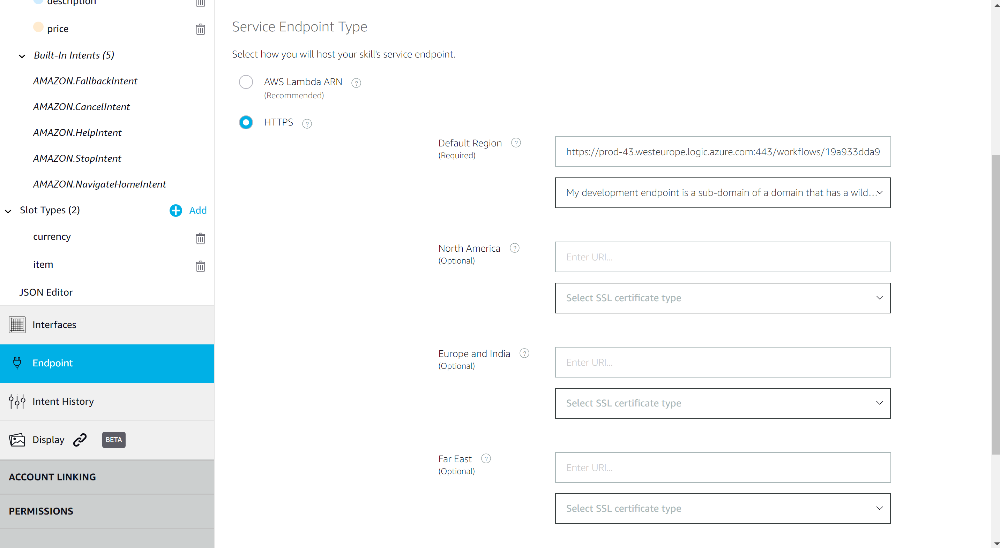

Select HTTPS for your endpoint type and past the URL for logic app in the box
named “Default Region”

Click the Build button and then click the Test tab.

Next you will create a key on the Service Bus that you will use to send the
information from Alexa to Logic Apps.

Go to the resource group for your Workbench deployment and navigate to the
ingressqueue.

Create a key that has the ability to write and manage.

Once the key is created write down the connection string for the service bus.

Note – manage is a permission required by Logic Apps.

Next go back to the logic app and add an Initialize Variable step below the
trigger. Populate the name parameter as “RequestId” and using the dynamic
content window, select guid().

The connector should resemble the screen below.

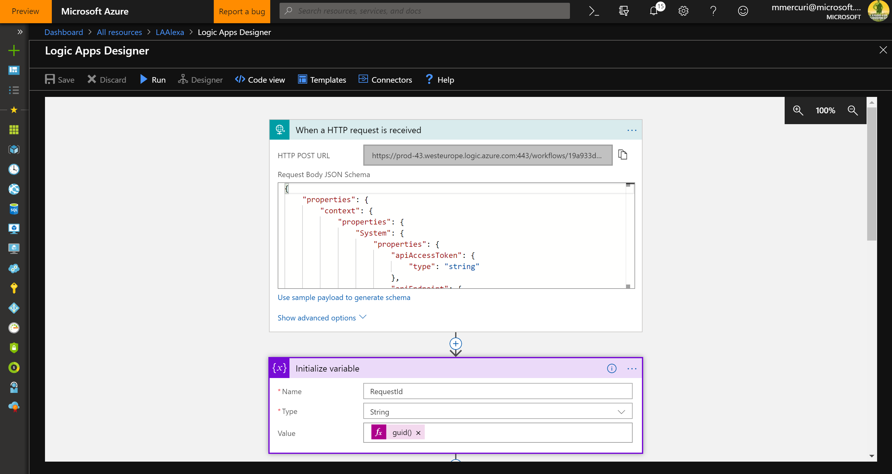

Next, click Insert a New Step link in the workflow and select the Send Message
action from the Service Bus connector.

Populate the connector with the connection string for your service bus key
created earlier.

For the queue, select the ingressqueue.

Next copy and paste the following in the Content body of your message.

{

"requestId": "",

"userChainIdentifier": "",

"applicationName": "SimpleMarketplace",

"workflowName": "SimpleMarketplace",

"parameters": [

{

"name": "description",

"value": ""

},

{

"name": "price",

"value": ""

}

],

"connectionId": 1 ,

"messageSchemaVersion": "1.0.0",

"messageName": "CreateContractRequest"

}

Using the dynamic content window, select the appropriate properties available
such as the constructor values for description and price.

The action should resemble the following screenshot –

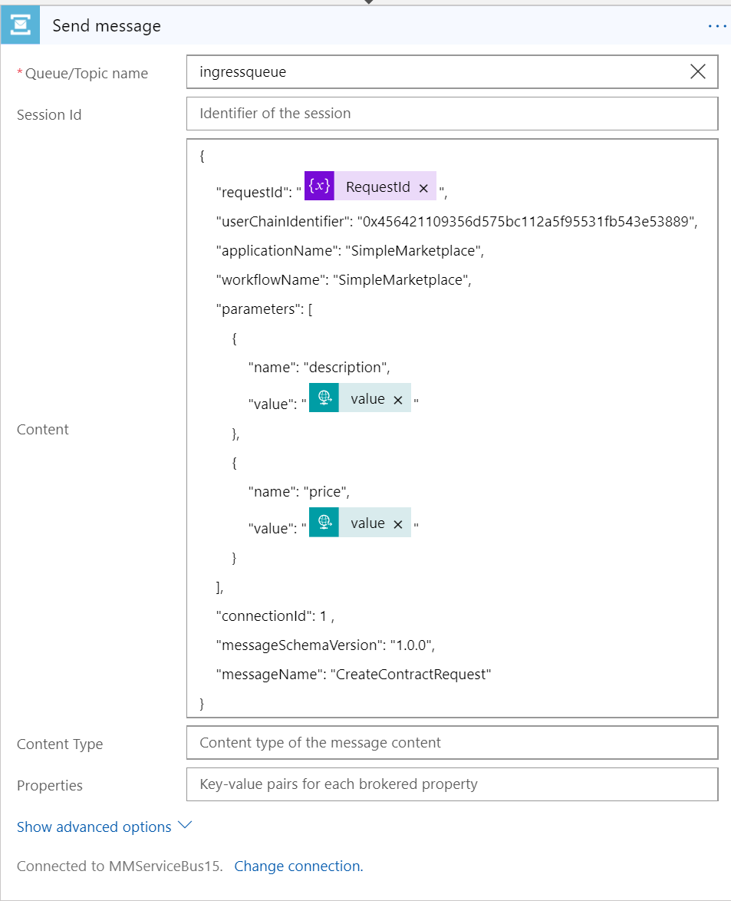

If you would like to do a look up of the id of the caller with their email
address held in Azure Active Directory in Azure Blockchain Workbench, you will
need to be authorized by the user to get the id.

[This blog](https://www.jovo.tech/tutorials/alexa-login-with-amazon-email)
explains how this can be done. Once this is done, you will need to maintain a
mapping between a common id in workbench, e.g. email, and the email from Amazon
used with Alexa.

Next, add a HTTP Response action that will return detail back to Alexa Skills
service.

The status code for the action should be 200 and the body should resemble the
below –

{

"response": {

"outputSpeech": {

"text": "Your is now offered for sale for.",

"type": "PlainText"

}

},

"version": "1.0"

}

Within the text, use the Dynamic Content window to add the first occurrence of
“value” after the word “Your”” and the second occurrence of value in the last
after the word “for”

Once this is done go back to the Alexa Developer Console and select the Test
tab.

Click the slider to say that Test is enabled for this skill.

Next type “ask simplemarketplace to sell my xbox for 350 dollars”

The result should be similar to what is displayed below. It will interpret the
text using the utterances and slots defined earlier and then send a payload to
the logic app.

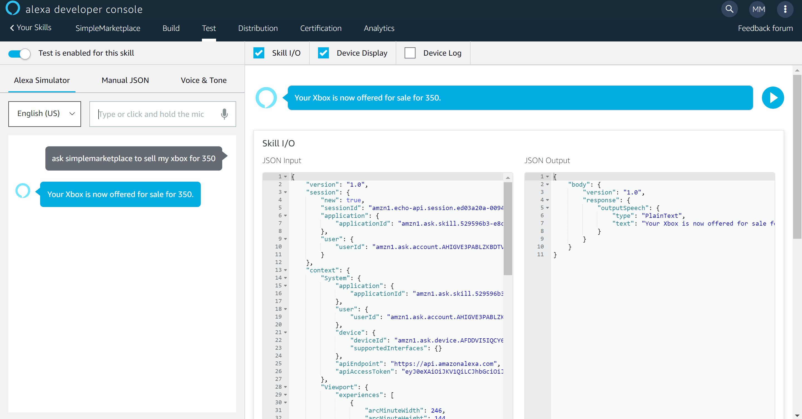

The logic app will receive the message, create a record on the blockchain using
the messaging API, and then send a response back to the caller.

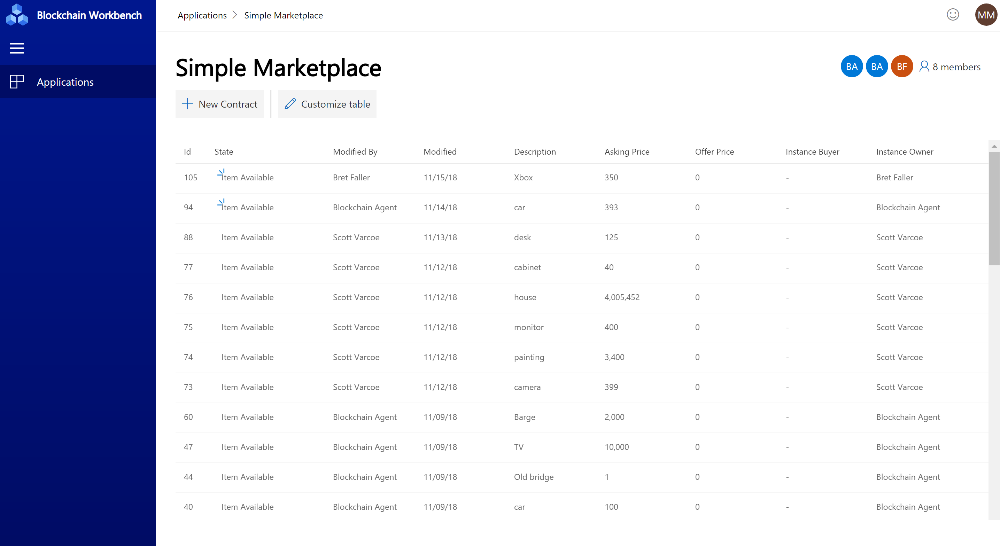
